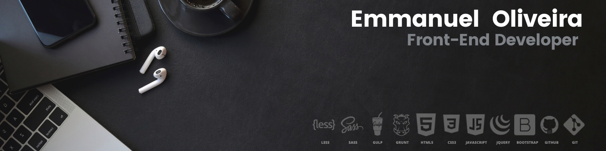
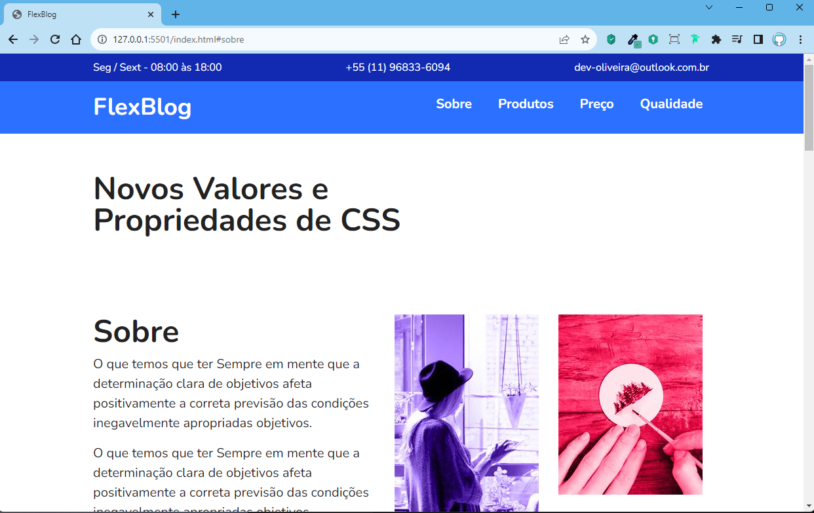
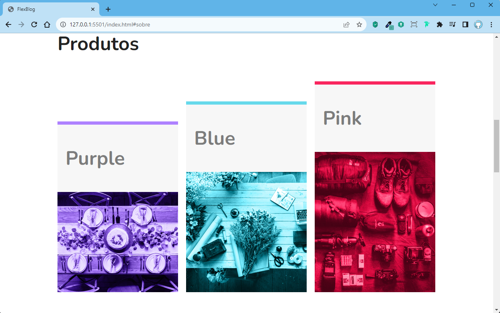
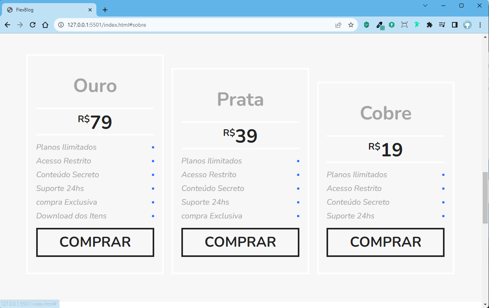
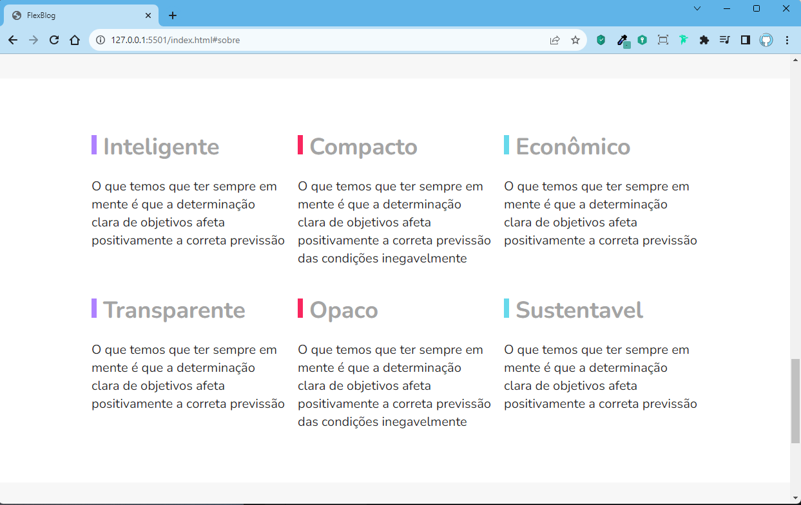
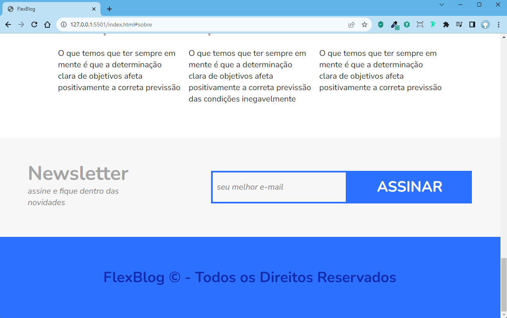
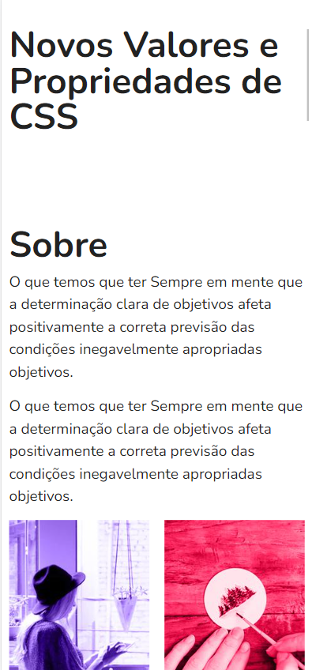
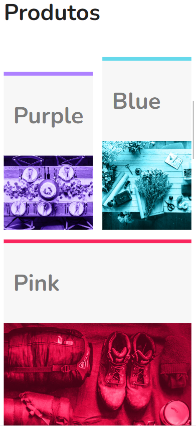
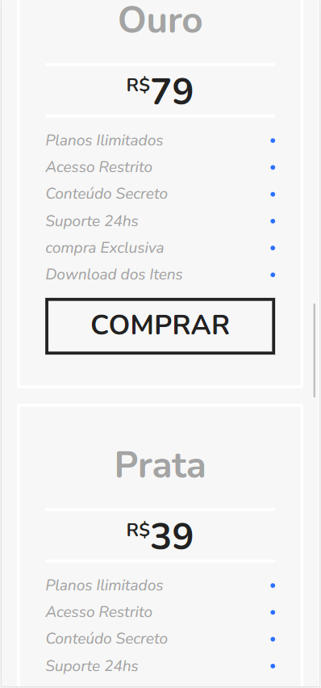
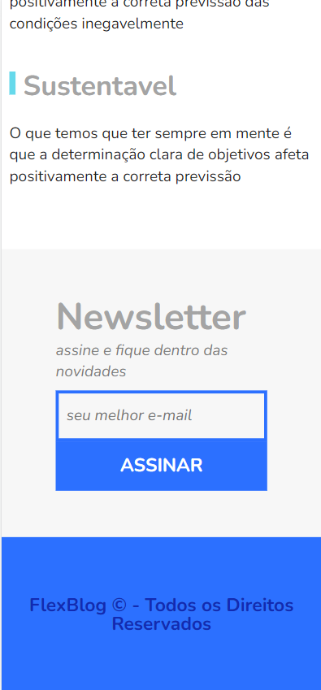

 
 

[Descrição](#--descrição-do-projeto-) |
[Funcionalidades](#%EF%B8%8F-funcionalidades) |
[Imagens](#-imagens-do-projeto-verão-web) |
[Tecnologias](#tecnologias-utilizadas-) |
[Como executar esse projeto ?](#%EF%B8%8F-como-executar-esse-projeto-) |
[Referências](#-referências-) |
[Autor](#-autor-) |

<h1 text-align="center"> 🌟Flex-Blog🌟</h1> 
 

<h2> ✅ Descrição do Projeto: </h2> 

   Esse projeto faz parte do Curso de CSS FlexBox da Origamid <https://origamid.com/>. Ele é o 
   projeto final do curso; nele aprendemos vários coneceitos de <strong>FlexBox</strong> Onde foi abordado todas as prorpriedades do FlexBox  

  ✅Container  
  ✅Display flex 
  ✅Flex Direction 
  ✅Flex wrap 
  ✅flex flow 
  ✅justify-content 
  ✅align-itens 
  ✅align content  
   

   ---
 

✔️Flex-itens  
✔️ flex-grow 
✔️ flex-basis 
✔️ flex-shirink 
✔️ flex 
✔️ order 
✔️ align-self 

  <h2>⚙️ Funcionalidades</h2>

 Esse projeto foi feito para estimular a praticar as tecnicas de flexbox ensinadas no curso pela  <strong>Origamid</strong>.  
🟡Flex-Container 
🔵 Flex-itens 

>Aqui podemos ver os Modelos suas caracteristicas, valores e solicitar um orçamento atráves de um formulário, pois as biciletas são fabricadas sob Medida.

 

 <h2>📸 Imagens do Projeto verão web.</h2>

> :bulb: **Dica:** Algumas imagens da versão Desktop.

 

 
  

 <h2>📱 Imagens do Projeto verão Mobile.</h2>

 > :bulb: **Dica:** Algumas imagens da versão Mobile.

 
 
 
 

<h2>🪛Tecnologias Utilizadas </h2>

✅HTML 
✅CSS 

 <h2>🛣️ Como Executar esse projeto ?</h2>

Para ter Acesso ao Projeto; clique no link Abaixo:   
> [Flex-Blog](https://bikcraft-woad.vercel.app/)

<h2> 📚Referências </h2>

> :memo: **Note:** [Origamid](https://origamid.com)

 <h2>👨🏻‍🦱 Autor </h2>
<h3> <a href="https://oliveira-portifolio.vercel.app/">Dev-Oliveira</a> </h3>

  
    
   
&copy; Todos os Direitos Reservados

<h1> 😁Obrigado por chegar até aqui!</h1>

